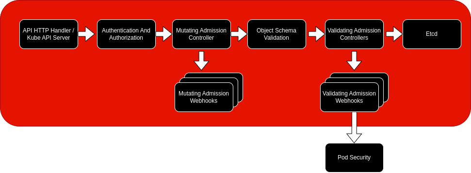

# Pod Admission and SCCs Version 2 in OpenShift

With this blog post I intend to update some of the content I previously worked on about [Security Context Constraints](https://cloud.redhat.com/blog/introduction-to-security-contexts-and-sccs) and [Linux Capabilities](https://cloud.redhat.com/blog/linux-capabilities-in-openshift) in OpenShift given the latest pod security standards implementation in Kubernetes and important improvements implemented from OpenShift 4.11 and beyond on SCCs. I will also use this opportunity to share some of the most important links and docs in a single place for those interested in the subject.

## What is Pod Security Admission?

Pod Security Admission is the process of validating pod creation at the API level based on security options requested in the pod definition. Those security options will reside mostly on the Security Context field present both at the pod level and the container level in the pod's manifest. Some other fields that relate to host resources such as PIDs, file system paths and networking may be validated as well.

With the deprecation of the [Pod Security Policies](https://kubernetes.io/blog/2021/04/06/podsecuritypolicy-deprecation-past-present-and-future/) and the creation of Pod Security Standards another special controller is added to Kubernetes in version 1.25 called [PodSecurity](https://kubernetes.io/docs/reference/access-authn-authz/admission-controllers/#podsecurity) controller. This is the admission controller that validates workloads being requested against the [Pod Security Standards](https://kubernetes.io/docs/concepts/security/pod-security-standards/).

The graph below shows the Workload Admission Flow in OpenShift as well as in Kubernetes. Pod security is in the validating phase of the admission process. It's part of a new controller compiled within the kube-apiserver binary and therefore it's a kubernetes built-in feature.

</img>

## How does Pod Security Admission work?

It works by separating policies in three different levels: privileged, baseline and restricted. Those levels are activated per namespace with application of a label on the respective namespace. Privileged is completely unrestricted, baseline has some restriction on certain privileged escalations and restricted is what the name implies the most restricted one.

Each of those three levels can be configured in three different modes: 
- `enforce`: rejecting creation on non compliant requests. 
- `audit`: creating an entry in audit log but allowing creation. 
- `warn`: sending a warning message to the user but allowing creation. 

Besides that those levels can be enabled simultaneously in the same namespace. Check the [Pod Security Admission docs](https://kubernetes.io/docs/concepts/security/pod-security-admission/) for more information.

In OpenShift, the privileged level is enforced Globally. Another controller will synchronize the labels to match the highest privileged profile among the Service Accounts present in that namespace. For example, if a service account has access to use the privileged SCC, the labels will be updated with warn and audit on privileged level to prevent unnecessary warnings or audit entries. Exceptions to this rule are system namespaces such as `default`, the ones starting with `kube` or starting with `openshift` that are part of the cluster installation. Those namespaces have label synchronization permanently disabled. [Here](https://docs.openshift.com/container-platform/latest/authentication/understanding-and-managing-pod-security-admission.html) you can find more details on label synchronization.

Here is what happens when we bind a service account with a privileged SCC.

By creating a brand new empty namespace and then checking its labels we can see the default rules applied. It has audit and warn configuration set both to version 1.24 and restricted mode.

```
oc describe ns test

Name:         test
Labels:       kubernetes.io/metadata.name=test
              pod-security.kubernetes.io/audit=restricted
              pod-security.kubernetes.io/audit-version=v1.24
              pod-security.kubernetes.io/warn=restricted
              pod-security.kubernetes.io/warn-version=v1.24
Annotations:  openshift.io/sa.scc.mcs: s0:c26,c10
              openshift.io/sa.scc.supplemental-groups: 1000670000/10000
              openshift.io/sa.scc.uid-range: 1000670000/10000
Status:       Active

No resource quota.

No LimitRange resource.
```

Creating a test service account:
```
oc create sa test-sa

serviceaccount/test-sa created
```

Binding it to the default privileged SCC:
```
oc apply -f - <<EOF
apiVersion: rbac.authorization.k8s.io/v1
kind: ClusterRoleBinding
metadata:
  name: use-privileged-scc
subjects:
- kind: ServiceAccount
  name: test-sa
  namespace: test
roleRef:
  kind: ClusterRole
  name: system:openshift:scc:privileged
EOF
```

Now check the namespace again and remark that the label values changed to privileged. By default, it is configured to synchronize to the highest privileged SCC in use by a service account on that particular namespace as we said. Any non-privileged pod creation won’t generate any warnings so that won’t interfere with SCC policies. This makes a good use of Pod Admission on that namespace preventing unnecessary warnings and audit messages.
```
oc describe ns test

Name:         test
Labels:       kubernetes.io/metadata.name=test
              pod-security.kubernetes.io/audit=privileged
              pod-security.kubernetes.io/audit-version=v1.24
              pod-security.kubernetes.io/warn=privileged
              pod-security.kubernetes.io/warn-version=v1.24
Annotations:  openshift.io/sa.scc.mcs: s0:c26,c10
              openshift.io/sa.scc.supplemental-groups: 1000670000/10000
              openshift.io/sa.scc.uid-range: 1000670000/10000
Status:       Active

No resource quota.

No LimitRange resource.
```
## How does that compare with Security Context Constraints?

Security Context Constraints are evaluated by a different controller under the OpenShift API and is also part of the overall Pod Admission process in OpenShift giving a much more granular control over pod security contexts. It can be customized and could be considered as a different layer of defense. While Pod Security Standards are applied to all pods created in a given namespace with labels, SCCs provide customizable validation applied to specific pods through Role Based Access Control (RBAC). So instead of a label applied to a namespace we need a Role or ClusterRole that allows the use of a SCC and a RoleBinding or ClusterRoleBinding that ties that SCC to a service account.

Since in OpenShift the pod admission by default is privileged, enforced globally and has the restricted setting only with warn and audit on all namespaces, SCCs will be required to further validate pod requests if no changes are made to pod admission settings. Besides that, another controller will create new warn and audit labels for those namespaces where service accounts with SCC granted privileges exists.

In previous blog posts, I explored the definitions and explained how SSCs work in relation to Pods, Containers and process privileges inside a worker node.

For reference you can check the links below:

* [Introduction to Security Contexts and SCCs](https://cloud.redhat.com/blog/introduction-to-security-contexts-and-sccs)
* [Managing SCCs in OpenShift](https://cloud.redhat.com/blog/managing-sccs-in-openshift)

## What is new in Security Context Constraints Version 2

Since OpenShift 4.11 release we have new SCCs or version 2 of some SCCs. Those bring some important improvements in the security domain. They are `hostnetwork-v2`, `nonroot-v2` and `restricted-v2`. Let's explore what is exactly different in those SCCs and understand what impact it has on workloads running in OpenShift.

| Version 1 | Version 2 |
|------------|---------------|
|allowPrivilegeEscalation: true| allowPrivilegeEscalation: false |
| allowedCapabilities: null | allowedCapabilities: <br>- NET_BIND_SERVICE
|requiredDropCapabilities: <br>- KILL <br>- MKNOD <br>- SETUID <br>- SETGID  | requiredDropCapabilities: <br>- ALL
| | seccompProfiles: <br>- runtime/default

Their description explains in a few lines what is different from the legacy version of restricted, hostnetwork and nonroot SCCs.

    kubernetes.io/description: restricted-v2 denies access to all host features and
      requires pods to be run with a UID, and SELinux context that are allocated to
      the namespace. This is the most restrictive SCC and it is used by default for
      authenticated users. On top of the legacy 'restricted' SCC, it also requires
      to drop ALL capabilities and does not allow privilege escalation binaries. It
      will also default the seccomp profile to runtime/default if unset, otherwise
      this seccomp profile is required.

<br>

    kubernetes.io/description: hostnetwork allows using host networking and host ports
      but still requires pods to be run with a UID and SELinux context that are allocated
      to the namespace. On top of the legacy 'hostnetwork' SCC, it also requires to
      drop ALL capabilities and does not allow privilege escalation binaries. It will
      also default the seccomp profile to runtime/default if unset, otherwise this
      seccomp profile is required.

<br>

    kubernetes.io/description: nonroot provides all features of the restricted SCC
      but allows users to run with any non-root UID.  The user must specify the UID
      or it must be specified on the by the manifest of the container runtime. On
      top of the legacy 'nonroot' SCC, it also requires to drop ALL capabilities and
      does not allow privilege escalation binaries. It will also default the seccomp
      profile to runtime/default if unset, otherwise this seccomp profile is required.
    
We can see that there are three areas or topics that were touched in the SCC manifest. They are privilege escalation, Linux capabilities and Seccomp profiles. Let's look closely into them:

### A. Privilege Escalation

By privilege escalation here we do not mean gaining privileges to necessarily perform a system attack. Privilege escalation is a normal Linux activity that can be exploited though. The Linux security credential check verifies the privilege escalation bits annotated on the extended attributes of each binary. Those can be general such as SUID or SGID allowing users to set the user id or group id of a process and therefore run as root. For example or they can be related to capabilities allowing the process to gain specific privileges beyond the ones inherited from its parent process.

What does that mean for containers? Containers are processes like any other process and they can by themselves call binaries available in their file systems and create child processes within their namespace context. If any of those binaries are marked with SUID, SGID bits or have file capabilities embedded on them they may request privilege escalation to perform certain actions. With privilege escalation set to true on both the SCC applied to a container and its security context they will be granted that privilege. Even if all capabilities are dropped and the SCC is restricted and doesn't allow the container to run as root a child process may be created by the container with elevated privileges if its binary has those magic bits. The first line of defense against a security weakness caused by those types of files in this case would be using a heavily restricted and smart image scanning process to prevent the files to get there in the first place.

With privilege escalation set to false no child process can elevate its privileges by this method even if the file is available to the container, which is a great improvement in security. And if a container tries to run a process with elevated privileges that will be denied and may be logged for further investigation.

If you want to understand in detail how linux capabilities in the container world work and how file capabilities could be used to elevate privileges with privilege escalation set to true, you may check the blog post [Linux Capabilities in OpenShift](https://cloud.redhat.com/blog/linux-capabilities-in-openshift). Some of the examples there would only work with restricted SCC version 1 for having the privilege escalation set to true.

Just as an example we can rerun one of the examples we show in the linux capabilities articles with file capabilities:

Let's say we have a container image with the `nc` command altered to have CAP_NET_BIND capability in the binary itself like below.
```
FROM nicolaka/netshoot
RUN setcap 'cap_net_bind_service+ep' /usr/bin/nc
CMD ["/usr/bin/nc", "-lvu", "443"]
```

Now let's create an unprivileged pod exactly as the example we had before:

```
oc apply -f - <<EOF
apiVersion: apps/v1
kind: Deployment
metadata:
  name: nonroot-capset
  namespace: test
spec:
  replicas: 1
  selector:
    matchLabels:
      name: nonroot-capset
  template:
    metadata:
      labels:
        name: nonroot-capset
    spec:
      containers:
        - name: nonroot-capset
          image: quay.io/acmenezes/nc-cap:test
          imagePullPolicy: Always
EOF
```
Here is what happens. Pod is in error state.
```
oc get pods                                                             

NAME                               READY   STATUS    RESTARTS   AGE                                                              
nonroot-capset-6d4b856b6-chdk7     0/1     Error     0          10s                                                              
privileged-test-848db66c59-x7k6c   1/1     Running   0          77m   
```

Let's check the logs:
```
oc logs nonroot-capset-6d4b856b6-chdk7
exec /usr/bin/nc: operation not permitted
```

This is due to `privilege: false` in restricted-v2 SCC which is attributed to this Pod. With that operation when the nc command is run it "requests" a privilege escalation to the system which is not allowed anymore. Therefore we have one more layer blocking that feature. If you want to see the example with the legacy restricted SCC check the previous blog post on capabilities [here](https://cloud.redhat.com/blog/linux-capabilities-in-openshift).

```
oc describe pods nonroot-capset-6d4b856b6-chdk7 | grep scc

                  openshift.io/scc: restricted-v2
```

### B. Linux Capabilities

Capabilities are sets of permissions that come from the privileged user. It was conceived in order to split superuser permissions into smaller chunks and allow non-privileged processes to execute partially privileged tasks. Well, some are actually quite privileged but still don't have all the capabilities of root nominally. Those SCCs that were supposed to be used with the non-root user were dropping only the capabilities considered more dangerous such as KILL, MKNOD, SETUID and SETGID. With v2 they drop ALL and allow only for CAP_NET_BIND_SERVICE which enables containers to make a better use of their port ranges in their network namespace if one tries to bind to a low range (below 1024) port number. And here we're talking exclusively about process capabilities, requested per Pod or container, not file capabilities like above. You can check the differences in the blog post mentioned above.


### C. Seccomp profiles

Seccomp or [Secure Computing](https://man7.org/linux/man-pages/man2/seccomp.2.html), sometimes called secure computing mode, is a kernel feature capable of filtering system calls. Instead of blocking a container for privileges it requested or blocking a child process from elevating its privileges, it will filter system calls performed by an application from user space to the kernel. It uses [BPF](https://lwn.net/Articles/909095/) to catch system calls on the fly reducing the kernel surface exposed to user applications. It's a completely different perspective since it's not easy to pin point what privileges or capabilities grant access to a specific system call and those are not a one to one relationship since some capabilities may grant access to multiple system calls at the same time. Another point is that system calls are not tied to a file or a process as a credential that can be validated but can be performed at any point on the lifetime of a process.

See a little bit below some concerns for example around the [unshare](https://man7.org/linux/man-pages/man2/unshare.2.html) system call. It's so powerful that by using the command that executes it I can start building a [container by hand](https://github.com/acmenezes/container-the-hard-way/blob/master/docs/04-namespaces.md) with no podman or docker. This is an [old tutorial](https://github.com/acmenezes/container-the-hard-way) I wrote quite a few years ago on how to do that. So imagine if a container runs an application that can create some child processes that can scape the container. That system call should be blocked by default specially after some vulnerabilities were discovered on that topic (see below).

Since version 1.19, Kubernetes implemented [seccomp profiles](https://kubernetes.io/docs/tutorials/security/seccomp/) enabling that feature to be applied on containers. Up to OpenShift 4.10, containers where unconfined in terms of systems calls, i.e. running without any Seccomp profile. From OpenShift 4.11 there is a default profile that allows many system calls to be performed. V2 SCCs will grant containers access to what is listed in the runtime/default profile. The filtering rules and system call names are arranged in a json file that must be available in the node where the containers are running. [Custom profiles](https://docs.openshift.com/container-platform/4.13/security/seccomp-profiles.html#custom-seccomp-profile) now can and should be configured with the minimum set of system calls an application needs and therefore provide the maximum level of security. Each user is now able to fine tune access to system calls.

## Security concerns addressed

Even having seccomp profiles in place, for unprivileged processes, [CRI-O](https://cri-o.io/), the OpenShift container engine, has removed the access to the unshare syscall. The dangerous one I mentioned above. Nice work done by the [CRI-O](https://cri-o.io/) team. You can check that out [here](https://github.com/cri-o/cri-o/pull/5788) and [here](https://github.com/cri-o/cri-o/blob/5951d4935f00bd1501dc510b68da1aa631c5ed72/internal/config/seccomp/seccomp.go#L28-L71). So unshare gets filtered from unprivileged processes by mutating the rules. That's a great security improvement in OpenShift.

To understand better the issue one can check this article published at the time by Acquasec: https://blog.aquasec.com/cve-2022-0185-linux-kernel-container-escape-in-kubernetes.

## Conclusion

Clearly there is way more to security than Pod Admission and SCCs but those two are the first layer of complexity that users and partners will face trying to run their applications and operators on OpenShift. With this quick article we shared an overview of the latest development on those two topics pointing out some useful links for the ones experimenting those features for the first time. I hope this is informative and helps you succeed and secure your application in OpenShift. Thanks for reading. See you next time!
