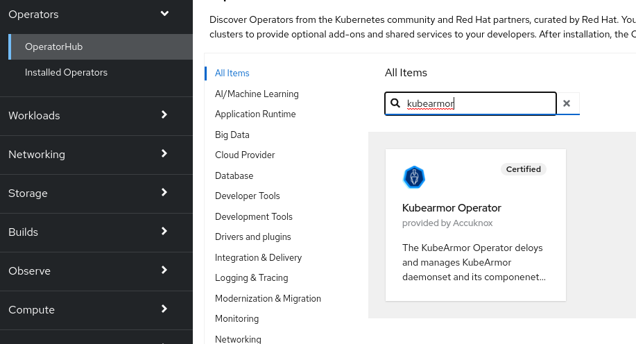
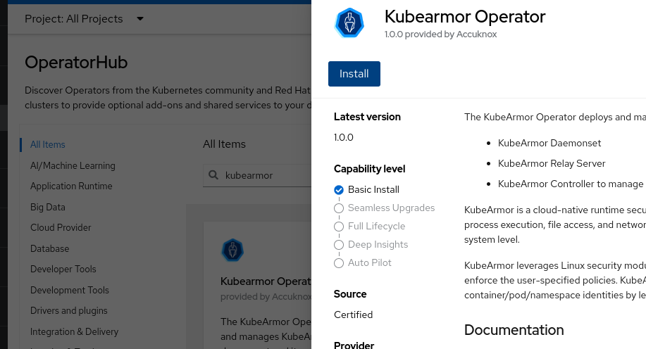
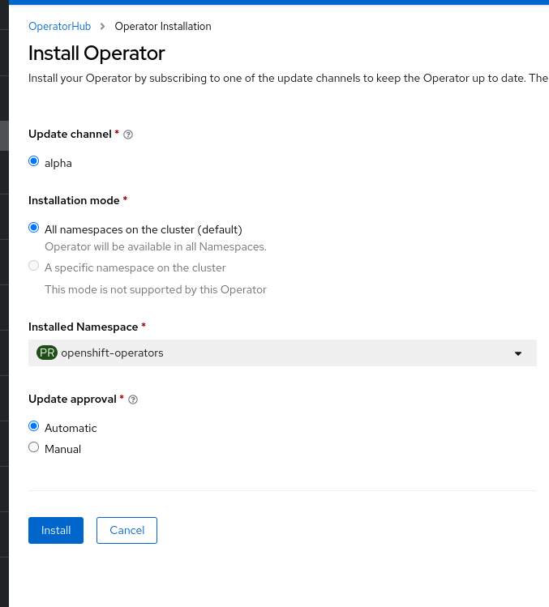

Leveraging KubeArmor for OpenShift Security

For those who tried once to configure Linux Security modules such as [SELinux](https://access.redhat.com/documentation/en-us/red_hat_enterprise_linux/9/html/using_selinux/getting-started-with-selinux_using-selinux) and [AppArmor](https://apparmor.net/) and apply them to containerized applications the pain of dealing with multiple system disciplines such as networking, system calls, file access becomes obvious very quick. Understanding and configuring them alone is already a challenge for newbies or the sporadic old school system admin. Now imagine connecting all that with specific container workloads, segmenting by namespace, node, or other classification criteria. Here comes an interesting tool that can be pretty valuable: KubeArmor.

[KubeArmor](https://kubearmor.io/) is a cloud native runtime security enforcement system for Kubernetes environments that provides granular and fine-grained protection for containerized workloads running within Kubernetes clusters. It enforces strong isolation and access controls, preventing malicious activities, and offering enhanced threat detection and mitigation capabilities by restricting behavior such as process execution, file access and networking operations etc. by using LSMs. Additionally, its detailed audit logs and real-time monitoring enable administrators to gain visibility into potential security incidents, facilitating proactive response and ensuring compliance with security policies. By incorporating KubeArmor into Kubernetes deployments, organizations can highly improve security, mitigate risks, and protect sensitive data from threats that target deployments at the system level.

How does Kubearmor do that? By automating the same LSMs we struggle with. LSMs ([Linux Security Modules](https://github.com/kubearmor/KubeArmor/wiki/Introduction-to-Linux-Security-Modules-(LSMs))) are an essential component of the Linux kernel that allows for detailed user activity inspection. LSM provides a framework for adding fine-grained access control and policy enforcement to running processes. These modules, such as SELinux, AppArmor or BPF-LSM for example, offer mechanisms to enforce mandatory access controls, restrict privileges, and mitigate vulnerabilities. Besides that KubeArmor generates rich alerts/telemetry events with container/pod/namespace identities by leveraging eBPF.

Let's Check an example on how we can run it in OpenShift:

KubeArmor is available and easily configurable as a certified kubernetes operator. You can find it in the OpenShift operator hub:

</img>

Open it and click install:
</img>

You have a few options in the next page. For demo purposes we let the default options and click install:
</img>

After a few minutes you should see a message saying it's installed.
</img>

If you check the openshift operators namespace for pods you should see the kubearmor-operator running.
```
oc get pods -n openshift-operators
NAME                                 READY   STATUS    RESTARTS   AGE
kubearmor-operator-cf654ff6c-hx6jd   1/1     Running   0          5m5s
```
Let's say you have a system architecture composed by multiple microservices. Each one of them running inside containers. You have partners providing some of those microservices and you don't have full control on what base images they are using or what modifications they made to some of those images. Or even they may be running as root inside those containers and you don't want them to execute certain files. How can we use kubearmor to prevent that file usage? Let's check some of the provided [examples](https://github.com/kubearmor/KubeArmor/blob/main/getting-started/security_policy_examples.md):

```
apiVersion: security.kubearmor.com/v1
kind: KubeArmorPolicy
metadata:
  name: ksp-ubuntu-2-proc-dir-recursive-block
  namespace: multiubuntu
spec:
  selector:
    matchLabels:
      container: ubuntu-2
  process:
    matchDirectories:
    - dir: /usr/
      recursive: true
  action:
    Block
```
According to kubearmor's documentation all access to the directory `/usr` should be blocked.

They provide a [deployment manifest](https://github.com/kubearmor/KubeArmor/blob/main/examples/multiubuntu/multiubuntu-deployment.yaml) for a few containers that allows us to play with the security policies managed by kubeArmor. It will create a new namespace called multiubuntu.

Let's try it:
```
oc apply -f multiubuntu-deployment.yaml
```

Ok. Now we have a test pod called ubuntu-2:
```
oc get pods -n multiubuntu | grep ubuntu-2
ubuntu-2-deployment-78fcd99688-vhqks   1/1     Running   0          9m24s
```

Let's log into this container and check if we can run something that is in the /usr directory:
```
c exec -it ubuntu-2-deployment-78fcd99688-vhqks -n multiubuntu -- /bin/bash
ubuntu-2-deployment-78fcd99688-vhqks:/$
```
Let's try `/usr/bin/env`to check the environment variables:
```
/usr/bin/env
HOSTNAME=ubuntu-2-deployment-78fcd99688-vhqks
KUBERNETES_PORT_443_TCP_PROTO=tcp
KUBERNETES_PORT_443_TCP_ADDR=172.30.0.1
KUBERNETES_PORT=tcp://172.30.0.1:443
PWD=/
HOME=/
KUBERNETES_SERVICE_PORT_HTTPS=443
KUBERNETES_PORT_443_TCP_PORT=443
KUBERNETES_PORT_443_TCP=tcp://172.30.0.1:443
TERM=xterm
NSS_SDB_USE_CACHE=no
SHLVL=1
KUBERNETES_SERVICE_PORT=443
PATH=/usr/local/sbin:/usr/local/bin:/usr/sbin:/usr/bin:/sbin:/bin
KUBERNETES_SERVICE_HOST=172.30.0.1
_=/usr/bin/env
```
It works. Finally let's apply the policy that we saw previously in the example:
```
oc apply -f - <<EOF
apiVersion: security.kubearmor.com/v1
kind: KubeArmorPolicy
metadata:
  name: ksp-ubuntu-2-proc-dir-recursive-block
  namespace: multiubuntu
spec:
  selector:
    matchLabels:
      container: ubuntu-2
  process:
    matchDirectories:
    - dir: /usr/
      recursive: true
  action:
    Block
EOF
```
Let's verify if it got created. You should see it like below:
```
c get KubeArmorPolicy -n multiubuntu
NAME                                    AGE
ksp-ubuntu-2-proc-dir-recursive-block   23s
```

Now let's try our test again inside the same container:
```

```

