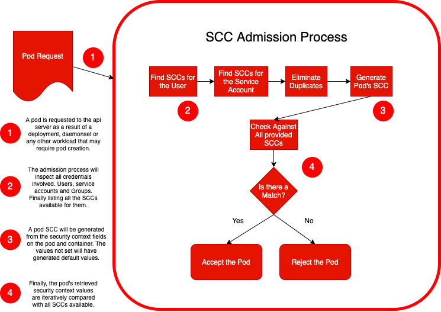
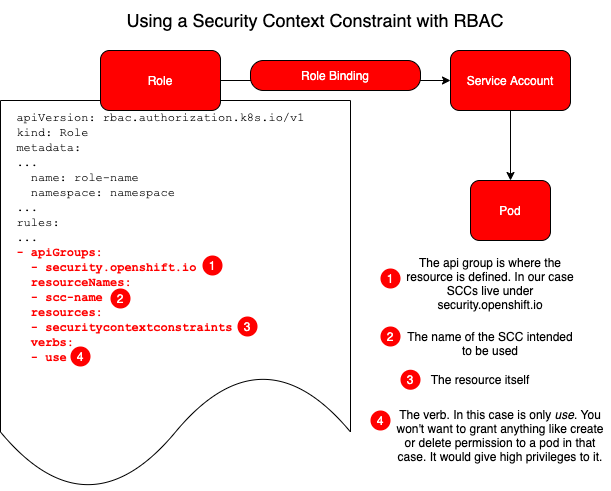

# Managing SCCs inOpenShift


On the first post we looked into Linux and process privileges and saw how containers have the exact same behaviours. We saw that those privileges are specific to the Linux user that the container process runs under. Also how security context is a special configuration that can be set on your pod or container manifest to request from theOpenShift API some of those privileges. And finally, we concluded showing that Security Context Constraints are the tool provided byOpenShift to control what kind of privileges being requested for each pod is allowed on the platform.


#### How does it actually work under the hood?

Unfolding a little bit more on how the SCCs work we may ask: what insideOpenShift takes care of checking if a Pod complies or not to it? The admission process in the API server will take care of that.OpenShift comes equipped with 8 predefined Security Context Constraints that you can list using the `oc get scc` command. For those who are not familiar with them, here they are in an attempt to list from most restrictive to the least (but check the comments):
|  SCC   |   Description  | Comments |
|--------| ---------------|----------|
|restricted|restricted denies access to all host features and requires pods to be run with a UID, and SELinux context that are allocated to the namespace.  This is the most restrictive SCC and it is used by default for authenticated users|In other words this is the most secure one. We explain it in detail further in this blog post.|
|nonroot|nonroot provides all features of the restricted SCC but allows users to run with any non-root UID. The user must specify the UID or it must be specified on the manifest of the container runtime.|Applications that need predictable non root UIDs with the same other  restricted SCC security features can use this SCC as long as they inform the UID in their manifest.|
|anyuid|anyuid provides all features of the restricted SCC but allows users to run with any UID and any GID.|platforms such as kubernetes andOpenShift this will be the equivalent as allowing UID 0, or root user, both inside and outside the container. That will be discussed in further blog posts. SELinux plays an important role here adding a layer of protection and it's a good idea to use seccomp to filter non desired system calls as well.|
|hostmount-anyuid|hostmount-anyuid provides all the features of the restricted SCC but allows host mounts and any UID by a pod.  This is primarily used by the persistent volume recycler. WARNING: this SCC allows host file system access as any UID, including UID 0.  Grant with caution.|Same warnings as anyuid but here it goes a bit further and allows mounting host volumes as well. Remark that the volume recycler mentioned on the description is a trusted workload and an essential infrastructure piece.|
|hostnetwork|hostnetwork allows using host networking and host ports but still requires pods to be run with a UID and SELinux context that are allocated to the namespace|Here the pod/container will be able to "see and use" the host network stack directly. Non zero UID and pre-allocated SELinux context will help put another layer of security.|
|node-exporter|node-exporter scc is used for the Prometheus node exporter|The node-exporter was designed for Prometheus to retrieve metrics from the cluster. It allows access to the host network, host PIDS, and host volumes, but not host IPC. Also allows anyuid. Not to be used by another application.|
|hostaccess|hostaccess allows access to all host namespaces but still requires pods to be run with a UID and SELinux context that are allocated to the namespace. WARNING: this SCC allows host access to namespaces, file systems, and PIDS.  It should only be used by trusted pods.  Grant with caution.|Host namespaces mean outside the pod or container namespace or node/root linux namespace. It is true that restricting UID and using SELinux will put a layer of security to protect the node. But still, it's a very relaxed SCC and should be used only by absolutely necessary trusted workloads.|
|Privileged|privileged allows access to all privileged and host features and the ability to run as any user, any group, any fsGroup, and with any SELinux context.  WARNING: this is the most relaxed SCC and should be used only for cluster administration. Grant with caution.|This scc allows a pod/container to control everything in the host/worker nodes or even in other containers. It's the most privileged and relaxed SCC policy. Only trusted workloads should use this and a discussion if it should be used in production or not is valid. A pod with that can administer the whole cluster.|


By default, inOpenShift, all pods and containers will use the Restricted SCC. Therefore they will be checked against it in the API server when requested. We will discuss more in depth some of those SCCs further and explore some security considerations we should keep in mind if not using the restricted SCC.

But in order to grant additional permissions, beyond those acquired with the restricted SCC, we need to make use of a different SCC. That can be one of those listed predefined SCCs or a custom built SCC. For that, we grant the permission to use the specified SCC to users, service accounts or groups.

When first requesting a pod to the API server, the credential to authorize the pod will be the user account requesting it. After that the pod itself will be running under its service account. If we don't specify a service account for our pod it will use the default service account available on the namespace it’s running. But every pod will run under a service account. So based on the user, service account and/or groups that the service account belongs to, the admission process responsible for checking the requested privileges will find the set of SCCs available and verify if there is a match between the requested resource security context and the constraints. If there is a match the pod is accepted otherwise it's rejected.

</img>

So the object requested only gets stored in Etcd, initiating a new pod creation, when it gets validated and matches the SCCs available otherwise it gets rejected and all the errors are logged. This is to get an idea of the complicated process that you can find on the apiserver-library-go (https://github.com/openshift/apiserver-library-go/blob/master/pkg/securitycontextconstraints/sccadmission/admission.go)

#### Caution: 

Be careful when using the oc command line interface to deploy pods!!! Normally we use oc as cluster admins users. That credential counts, as explained above, in the SCC admission process. It has a huge impact on security allowing anyuid to pods created that way. And it also creates confusion, some times, as well, when developers try to test using `oc apply -f` and everything works but when tested using automated processes the pod gets denied because that particular pod is requesting root privileges but it’s deployed by unprivileged automated users. That’s why, in production, we should grant lower privileges to CI/CD systems or operators to deploy our pods. If you need to test a deployment, deamonset etc. as it would be done by a CI system or operator, but using the oc CLI, you may impersonate their user with the following command:

`oc apply -f my-deployment.yaml --as=my-unprivileged-user`

#### Managing SCCs with the oc command line interface

Security Context Constraints areOpenShift objects as any other object. So the classic verbs used with the `oc` command can also be used with SCCs. Tasks such as describing, listing, creating, deleting and editing use the same command syntax as anything else. You need to be logged in with admin privileges in order to change or delete SCCs though.

So basically try `oc get scc` to list the available ones, `oc describe scc <scc name>` to check specific field values, `oc edit scc <scc name>` to change values or the `oc delete` to delete one. Remember that it is not a good practice to edit the predefined SCCs that come embedded withOpenShift. And of course you can specify an SCC yaml manifest and hit `oc create -f my-scc.yaml` such as the one below taken from the docs:

```
kind: SecurityContextConstraints
apiVersion: v1
metadata:
  name: scc-admin
allowPrivilegedContainer: true
runAsUser:
  type: RunAsAny
seLinuxContext:
  type: RunAsAny
fsGroup:
  type: RunAsAny
supplementalGroups:
  type: RunAsAny
users:
- my-admin-user
groups:
- my-admin-group
```
Other than that for the SCC commands check [here](https://docs.openshift.com/container-platform/4.3/authentication/managing-security-context-constraints.html#security-context-constraints-command-reference_configuring-internal-oauth) to see the examples on the docs.

Once we can see, create, edit and delete SCCs how can we bind them to our pods? One command that is pretty useful, overall in troubleshooting and developing, is the `oc adm policy` command. It’s pretty straightforward. Check these snippets from the context help:

```
Manage policy on pods and containers:
  add-scc-to-user                Add security context constraint to users or a service account
  add-scc-to-group               Add security context constraint to groups
  remove-scc-from-user           Remove user from scc
  remove-scc-from-group          Remove group from scc
```

To grant or bind an SCC to a user with the oc command line interface we have the command below:

`oc adm policy add-scc-to-user <scc-name-here> user-name`

To grant or bind an SCC to a service account with the oc command line interface we use the parameter -z:

`oc adm policy add-scc-to-user <scc-name-here> -z <service-account-name>`

To remove those SCCs we use the same process but with `remove-scc-from-user`:

`oc adm policy remove-scc-from-user <scc-name-here> user-name`

`oc adm policy remove-scc-from-user <scc-name-here> -z <service-account-name>`

With groups the process is similar:

`oc adm policy add-scc-to-group <scc-name-here> <group-name>`
`oc adm policy remove-scc-from-group <scc-name-here> <group-name>`

#### Let’s take a look on a quick example:

`oc create user johndoe`

`oc adm policy add-scc-to-user nonroot johndoe`

`oc get scc nonroot -o yaml`

We should see under users something like this:
```
users:
- johndoe
```

Now let’s do it with a service account:

Let’s create a namespace first:

`oc create namespace scc-test`
```
namespace/scc-test created
```

Let’s use this namespace as default using the project command:
`oc project scc-test`
```
Now using project "scc-test" on server ...
```

Finally let’s create the service account:
`oc create sa my-app-sa`
```
serviceaccount/my-app-sa created
```

Repeating the process we did for the user we can grant an SCC to a service account with the parameter -z:

`oc adm policy add-scc-to-user nonroot -z my-app-sa`
```
securitycontextconstraints.security.openshift.io/nonroot added to: ["system:serviceaccount:scc-test:my-app-sa"]
```
Let’s check now what’s under the users field:
`oc get scc nonroot -o yaml`
```
users:
- johndoe
- system:serviceaccount:scc-test:my-app-sa
```
#### Caution:

Pay careful attention to what namespace you’re in or use the -n parameter to make sure you’re adding the SCC to the service account you want on the correct namespace. Take a look at this line `system:serviceaccount:scc-test:my-app-sa` and notice that it means a service account on the system in the scc-test namespace named my-app-sa. Therefore, be precise while writing the namespace name and the service account as well. A typo here may be hard to catch and will give the impression that the required SCC is not working.

Another important point is that not all users or service accounts will be listed under this field because they may have granted SCCs using RBAC. Check below.


#### Managing SCCs with Role Based Access Control

When we create a role we may use a rule inside that role to define which SCCs we want available for the Service Accounts bound to that role. So the process is pretty simple. By mentioning the API group that is security.openshift.io, the type in the resources field that is securitycontextconstraints and adding the name and the verb “use”, that is what we want to do with it, we have a rule to compose the role. 

If you want to know more how Role Based Access Control works inOpenShift take a look at [theOpenShift RBAC docs](https://docs.openshift.com/container-platform/4.3/authentication/using-rbac.html)

If you want to check closely the type that represents the SCC check [here](https://github.com/openshift/api/blob/0de0d539b0c32b2f1d7255c3100a7e92df2a99e2/security/v1/types.go#L24
)

</img>

#### Managing SCCs with Operator Lifecycle Manager

If you don't know what operators are or didn't come across the Operator Lifecycle Manager, it is always time to learn!!! They are pretty handy to manage the whole application lifecycle in your infrastructure transforming human operational knowledge into code. They are the daily work of SREs! So if you want to know more about them you can begin [here](https://github.com/operator-framework/operator-sdk).


But if you are an operator expert and at this point you need to use an SCC with your operator to deploy your application, here is how you do it. You can configure it under your CSV (Cluster Service Version) when packaging the operator to be installed via the OLM. In the install section under the spec field we will have clusterPermissions and there you can put a rule defining the use of an SCC. OLM will apply those credentials to the listed service accounts in order to grant the permissions you need when installing your operator.

Here is an example of a CSV snippet:
```
...
  install:
    strategy: deployment
    spec:
...
      clusterPermissions:
       - rules:
            - verbs:
                - use
              apiGroups:
                - security.openshift.io
              resources:
                - securitycontextconstraints
              resourceNames:
                - my-scc-name                
          serviceAccountName: my-service-account
...
```

#### Tips on Troubleshooting SCCs

Troubleshooting SCCs can be quite challenging since it has so many ways to be configured and not always will present the service accounts and groups on the `oc get scc scc-name -o yaml` command. So first, things to keep in mind:
1. The admission process will evaluate all users, service accounts and groups involved to find all SCCs available. Don't forget that you will probably be using a cluster admin account with your `oc` commands and that changes the game when compared with using a regular non-privileged automated user.
2. The SCCs have a priority field that can enforce the order of precedence. If dealing with custom SCCs. Check that as well.
3. You can make use of the command `oc adm policy who-can` to list service accounts that can use a particular SCC. Check the example below:

`oc adm policy who-can use scc nonroot`

```
resourceaccessreviewresponse.authorization.openshift.io/<unknown>

Namespace: scc-test
Verb:      use
Resource:  securitycontextconstraints.security.openshift.io

Users:  system:admin
        system:serviceaccount:openshift-apiserver-operator:openshift-apiserver-operator
        system:serviceaccount:openshift-apiserver:openshift-apiserver-sa
        system:serviceaccount:openshift-authentication-operator:authentication-operator
        system:serviceaccount:openshift-authentication:oauth-openshift
        system:serviceaccount:openshift-cluster-node-tuning-operator:cluster-node-tuning-operator
        system:serviceaccount:openshift-cluster-version:default
        system:serviceaccount:openshift-controller-manager-operator:openshift-controller-manager-operator
        system:serviceaccount:openshift-kube-apiserver-operator:kube-apiserver-operator
        system:serviceaccount:openshift-kube-apiserver:installer-sa
        system:serviceaccount:openshift-kube-controller-manager-operator:kube-controller-manager-operator
        system:serviceaccount:openshift-kube-controller-manager:installer-sa
        system:serviceaccount:openshift-kube-scheduler-operator:openshift-kube-scheduler-operator
        system:serviceaccount:openshift-kube-scheduler:installer-sa
        system:serviceaccount:openshift-machine-config-operator:default
        system:serviceaccount:openshift-network-operator:default
        system:serviceaccount:openshift-operator-lifecycle-manager:olm-operator-serviceaccount
        system:serviceaccount:openshift-service-ca-operator:service-ca-operator
        system:serviceaccount:openshift-service-catalog-apiserver-operator:openshift-service-catalog-apiserver-operator
        system:serviceaccount:openshift-service-catalog-controller-manager-operator:openshift-service-catalog-controller-manager-operator
Groups: system:cluster-admins
        system:masters

```
4.	But check that, on the same test I did above, under users, complementing that list we find 2 other names with `oc get scc nonroot -o yaml`. They were added by the `oc adm policy` command.

```
users:
- johndoe
- system:serviceaccount:scc-test:my-app-sa

```
5.	Finally don't forget to check the roles and role bindings involved with your service accounts and all their respective namespaces.


#### Restricted SCC: The Most Secure Standard Choice

When a pod is created without explicitly using the PodSecurityContext field or the SecurityContext field under the container specifications it will use the Restricted SCC by default. Let’s analyze what it means.

Here are key features of the restricted SCC explained:

- Ensures that pods cannot run as privileged.

Privileged processes are the ones running under the root or superuser account with ID 0 on the host. And in that case privileged containers have root privileges inside and out the container namespace and can do anything on the host if all capabilities are available and no other mechanism like SELinux policies are in place. The restricted SCC prevents that request. If it comes with Privileged = true it will be blocked by the admission process.

- Ensures that pods cannot mount host directory volumes.

It doesn't allow to have host directory volume plugins enabled and the `hostpath` volume type is not listed. Giving that privilege to a Pod could open the door to exploits trying to write to forbidden paths on the host file system.
 
`oc get scc restricted -o yaml`
```
...
allowHostDirVolumePlugin: false
...
volumes:
- configMap
- downwardAPI
- emptyDir
- persistentVolumeClaim
- projected
- secret
...
```

- Requires that a pod run as a user in a pre-allocated range of UIDs.

When we talk about containers we have a few caveats to explore here because the container is namespaced. What that may mean is that if a particular container is using what we call user namespaces and UID mapping, we may end up having different users inside the container and outside the container for the same process. It's a complicated scheme that changes the way processes see their privileges across any type of Linux constructs in the file system depending on what namespace they are available. InOpenShift, at the time of this writing, those UIDs will be the same inside and outside the container meaning that the pod will be root on the host if the UID is 0. CRIO, the runtime engine can do UID mapping already, but the underlying Kubernetes platform is not prepared for that yet. That is out of scope here (we may explore this in future writings) but I think it’s an important thing to have in mind when considering UIDs. With the restricted SCC the Pod UID will be limited to a pre-allocated range of UIDs preventing any kind of manipulation that could lead to impersonation or illegal privilege escalation.

- Requires that a pod run with a pre-allocated MCS label.

MCS label stands for Multi Category Security label which is an enhancement to SELinux allowing users to label files with categories. SELinux comes enabled by default inOpenShift nodes and the Restricted SCC will use that resource to further restrict the Pods access protecting the host file system.

- Allows pods to use any FSGroup.

FSGroup is a special supplemental group that can be applied to all containers in a pod in order to enable them to own some specific volume on the host system. With this group set, kubelet is able to change the permission of that volume on behalf of the pod.

- Allows pods to use any supplemental group.

These are additional linux groups that can be added as well to the first process in each container granting some lower level user permissions to that process. 

#### Security Considerations When Not Using the Restricted SCC

In general lines, if not using the Restricted SCC, you may have granted privileges to a Pod that can partially affect the host, other pods or containers or even get full root access on the host. That may happen letting the Pod run under any user ID while using the anyuid SCC, allowing most host features using the hostaccess SCC, allowing extra capabilities on the AllowCapabilties field or giving full root privileges with the privileged SCC for example. 

If you have a very good case to use an SCC other than the Restricted SCC, it’s important to highlight that SCCs were designed to work with a good set of security resources available on the linux kernel. In general lines we can say: never run your pod as UID 0 or root. If you need a specific capability shoot for the least privileged one and do your best to use SELinux policies combined with Seccomp filtering and/or possibly AppArmor profiles. We will explore those features in future posts. The headline here is if going out of the standard Restricted scenario, for any reason, combine all the security technologies you can to protect your application and overall your data.

#### Conclusion

So today we discussed a little bit more in depth the tools that we currently have at hand to manage SCCs. We saw how the admission process happens and in what ways a pod gets denied if it's requiring more privileges than it should. We also had a walkthrough on the `oc` commands used to list, create, edit and delete SCCs if needed and grant SCCs to users, service accounts and roles as well. Together with that we dropped a few tips on troubleshooting and finally presented a bit more the standard Restricted SCC along with a few important security considerations when not using it.

Certainly some questions will arise. What if I'm dealing with CNFs (container network functions) and need to set up special network data planes that interact with the host network? What if I'm deploying special storage CSI drivers that require installing a different kernel module for my storage devices on my worker nodes to be used by my application? Or, so popular these days, what if I manage an automated platform that sets up GPUs as a service for data scientists to train their models and compute statistical learning workloads? Wouldn't all those cool things require a deeper level of host access? I would say… Certainly yes. Then we need to dig deeper and understand better each option we may craft under Security Contexts and their respective constraints and analyse some of the security implications we may end up dealing with. We'll slice those things in a few other posts. I hope this has been informative for you! More to come soon. Stay tuned!
